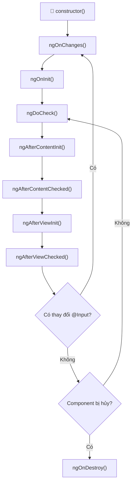
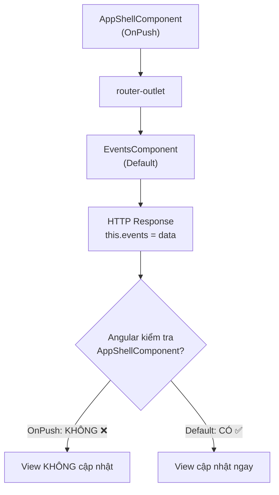

# Vòng Đời Component trong Angular (Lifecycle Hooks)

Khi Angular tạo, cập nhật và hủy một component, nó sẽ gọi một chuỗi các **lifecycle hooks** theo thứ tự cố định. Hiểu rõ vòng đời này giúp bạn biết **khi nào nên làm gì** trong component.

---

## Sơ đồ tổng quan



---

## Chi tiết từng giai đoạn

### 1. `constructor()` — Khởi tạo class

```typescript
export class EventsComponent {
  constructor(private eventService: EventService) {
    // ✅ Inject dependencies
    // ❌ KHÔNG gọi API hay truy cập DOM ở đây
  }
}
```

| Đặc điểm | Mô tả |
|-----------|--------|
| **Khi nào chạy** | Ngay khi Angular tạo instance của component |
| **Mục đích** | Inject dependencies (services) |
| **Lưu ý** | `@Input()` chưa có giá trị, DOM chưa tồn tại |

> [!CAUTION]
> **KHÔNG** gọi API, truy cập DOM, hay xử lý logic nghiệp vụ trong constructor. Chỉ dùng để inject service.

---

### 2. `ngOnChanges(changes: SimpleChanges)` — Khi `@Input()` thay đổi

```typescript
@Input() eventId!: string;

ngOnChanges(changes: SimpleChanges) {
  if (changes['eventId']) {
    console.log('Giá trị cũ:', changes['eventId'].previousValue);
    console.log('Giá trị mới:', changes['eventId'].currentValue);
    console.log('Lần đầu?:', changes['eventId'].firstChange);
    this.loadEventDetails(); // Tải lại dữ liệu khi input thay đổi
  }
}
```

| Đặc điểm | Mô tả |
|-----------|--------|
| **Khi nào chạy** | Trước `ngOnInit()` và mỗi khi `@Input()` thay đổi |
| **Mục đích** | Phản ứng khi dữ liệu từ component cha thay đổi |
| **Lưu ý** | Chỉ chạy nếu component CÓ `@Input()` |

> [!TIP]
> Dùng `ngOnChanges` khi bạn cần **react** lại mỗi khi prop từ cha thay đổi, ví dụ: component chi tiết sự kiện nhận `eventId` mới → tải lại dữ liệu.

---

### 3. ⭐ `ngOnInit()` — Khởi tạo logic (QUAN TRỌNG NHẤT)

```typescript
ngOnInit() {
  this.userRole = this.tokenService.getRole();
  this.loadEvents(); // ✅ Gọi API ở đây
}
```

| Đặc điểm | Mô tả |
|-----------|--------|
| **Khi nào chạy** | Một lần duy nhất, sau `ngOnChanges()` đầu tiên |
| **Mục đích** | Gọi API, khởi tạo dữ liệu, subscribe Observable |
| **Lưu ý** | `@Input()` đã có giá trị, nhưng DOM chưa render xong |

> [!IMPORTANT]
> Đây là hook **được dùng nhiều nhất**. 90% logic khởi tạo nên đặt ở đây, KHÔNG phải trong constructor.

**Ví dụ thực tế trong dự án của bạn:**

```typescript
// ✅ ĐÚNG - Gọi API trong ngOnInit
ngOnInit() {
  this.userRole = this.tokenService.getRole();
  this.loadEvents();
}

// ❌ SAI - Gọi API trong constructor
constructor(private eventService: EventService) {
  this.loadEvents(); // Input chưa sẵn sàng, có thể gây lỗi
}
```

---

### 4. `ngDoCheck()` — Kiểm tra thay đổi tùy chỉnh

```typescript
ngDoCheck() {
  // Chạy MỖI LẦN Angular kiểm tra change detection
  // Cẩn thận: hook này chạy RẤT NHIỀU lần!
  if (this.previousName !== this.currentName) {
    this.onNameChanged();
  }
}
```

| Đặc điểm | Mô tả |
|-----------|--------|
| **Khi nào chạy** | Mỗi lần Angular chạy change detection |
| **Mục đích** | Phát hiện thay đổi mà Angular không tự nhận ra (deep object changes) |
| **Lưu ý** | Chạy rất thường xuyên → tránh logic nặng |

> [!WARNING]
> Hook này chạy **cực kỳ thường xuyên** (mỗi click, mỗi keypress, mỗi HTTP response...). Chỉ dùng khi thật sự cần thiết và phải viết code rất nhẹ.

---

### 5. `ngAfterContentInit()` — Sau khi content projection hoàn tất

```typescript
// Component cha
@Component({
  template: `
    <app-card>
      <h2>Nội dung được chiếu vào</h2>  <!-- Content projection -->
    </app-card>
  `
})

// Component con (app-card)
@Component({
  template: `
    <div class="card">
      <ng-content></ng-content>  <!-- Nơi nhận content -->
    </div>
  `
})
export class CardComponent {
  @ContentChild('title') titleRef!: ElementRef;

  ngAfterContentInit() {
    // ✅ ContentChild đã sẵn sàng ở đây
    console.log(this.titleRef);
  }
}
```

| Đặc điểm | Mô tả |
|-----------|--------|
| **Khi nào chạy** | Một lần, sau khi `<ng-content>` được khởi tạo |
| **Mục đích** | Truy cập nội dung được project vào component |

---

### 6. `ngAfterContentChecked()` — Sau mỗi lần kiểm tra content

| Đặc điểm | Mô tả |
|-----------|--------|
| **Khi nào chạy** | Sau mỗi lần Angular kiểm tra content projection |
| **Mục đích** | Phản ứng khi projected content thay đổi |
| **Lưu ý** | Chạy thường xuyên, tương tự `ngDoCheck` |

---

### 7. `ngAfterViewInit()` — Sau khi view render xong

```typescript
@ViewChild('chartCanvas') chartCanvas!: ElementRef;

ngAfterViewInit() {
  // ✅ DOM đã render xong, có thể thao tác DOM
  this.initChart(this.chartCanvas.nativeElement);
}
```

| Đặc điểm | Mô tả |
|-----------|--------|
| **Khi nào chạy** | Một lần, sau khi template và các component con render xong |
| **Mục đích** | Thao tác DOM, init thư viện bên ngoài (chart, map...) |
| **Lưu ý** | `@ViewChild` mới có giá trị ở đây |

> [!TIP]
> Dùng hook này khi cần: khởi tạo chart, khởi tạo Google Maps, focus vào input, hoặc bất kỳ thao tác DOM nào.

---

### 8. `ngAfterViewChecked()` — Sau mỗi lần kiểm tra view

| Đặc điểm | Mô tả |
|-----------|--------|
| **Khi nào chạy** | Sau mỗi lần Angular kiểm tra view |
| **Lưu ý** | Chạy rất thường xuyên, tránh logic nặng |

---

### 9. ⭐ `ngOnDestroy()` — Khi component bị hủy (QUAN TRỌNG)

```typescript
private subscription = new Subscription();

ngOnInit() {
  // Lưu subscription để hủy sau
  this.subscription.add(
    this.eventService.GetEvents().subscribe(data => {
      this.events = data;
    })
  );
}

ngOnDestroy() {
  // ✅ Hủy tất cả subscriptions để tránh memory leak
  this.subscription.unsubscribe();
}
```

| Đặc điểm | Mô tả |
|-----------|--------|
| **Khi nào chạy** | Khi component bị xóa khỏi DOM (chuyển trang, *ngIf=false) |
| **Mục đích** | Dọn dẹp: hủy subscription, clear interval, remove event listener |

> [!CAUTION]
> **Luôn hủy subscription** trong `ngOnDestroy()` để tránh **memory leak**! Đây là lỗi phổ biến nhất của developer Angular.

---

## Bảng so sánh tổng hợp

| Hook | Số lần chạy | Dùng để làm gì |
|------|-------------|-----------------|
| `constructor` | 1 lần | Inject services |
| `ngOnChanges` | Nhiều lần | React khi @Input thay đổi |
| **`ngOnInit`** | **1 lần** | **Gọi API, khởi tạo dữ liệu** |
| `ngDoCheck` | Rất nhiều | Custom change detection |
| `ngAfterContentInit` | 1 lần | Truy cập projected content |
| `ngAfterContentChecked` | Nhiều lần | Kiểm tra projected content |
| `ngAfterViewInit` | 1 lần | Thao tác DOM, init chart |
| `ngAfterViewChecked` | Nhiều lần | Kiểm tra view |
| **`ngOnDestroy`** | **1 lần** | **Dọn dẹp, hủy subscription** |

---

## ChangeDetectionStrategy và vòng đời

Liên quan trực tiếp đến lỗi bạn vừa gặp:

### `Default` (Mặc định)
```typescript
changeDetection: ChangeDetectionStrategy.Default
```
- Angular kiểm tra **toàn bộ cây component** mỗi khi có sự kiện (click, HTTP response, setTimeout...)
- An toàn, dễ dùng, nhưng có thể chậm với ứng dụng lớn

### `OnPush` (Tối ưu hiệu năng)
```typescript
changeDetection: ChangeDetectionStrategy.OnPush
```
- Angular **CHỈ kiểm tra** component khi:
  1. `@Input()` reference thay đổi
  2. Sự kiện DOM xảy ra **trong** component
  3. `async` pipe emit giá trị mới
  4. Gọi `markForCheck()` thủ công

### Lỗi bạn gặp phải:



**Giải thích:** `EventsComponent` nhận data từ API → gán `this.events` → nhưng Angular không re-render vì component cha (`AppShellComponent`) dùng `OnPush` → Angular "bỏ qua" toàn bộ cây con → HTML không cập nhật cho đến khi bạn click (tạo sự kiện DOM).

> [!IMPORTANT]
> **Quy tắc vàng:** Không nên dùng `OnPush` cho layout component chứa `<router-outlet>`, vì nó sẽ chặn change detection của tất cả các component con được route vào.

---

## Ví dụ thực tế trong dự án của bạn

### Luồng hoạt động khi bạn truy cập `/admin/events`:

```
1. Angular Router nhận URL /admin/events
2. Tìm route → match AppShellComponent (layout)
3. Trong <router-outlet> → tạo EventsComponent
4. constructor() → Inject EventService, TokenService...
5. ngOnChanges() → Không chạy (không có @Input)
6. ngOnInit() → Gọi loadEvents() → HTTP GET API
7. ngDoCheck() → Change detection chạy
8. ngAfterContentInit() → Content init
9. ngAfterViewInit() → DOM render xong (nhưng chưa có data!)
10. === API trả về ===
11. subscribe callback → this.events = res.items
12. Angular chạy change detection → Render danh sách events
```

### Tại sao bước 12 bị chặn với OnPush?
Vì bước 12, Angular kiểm tra từ root component xuống → đến `AppShellComponent` → thấy `OnPush` → kiểm tra: `@Input` thay đổi? Không. Sự kiện DOM? Không. → **BỎ QUA** → `EventsComponent` không được re-render.
